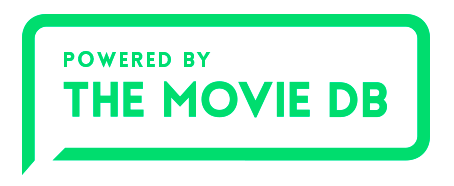

# Box Office Prediction: A Project

In a world where movies made an estimated $41.7 billion in 2018, the film industry is more popular than ever. But what movies make the most money at the box office? How much does a director matter? Or the budget? Having been following box office as a side hobby for a while, this project was definitely one of my favorites to do. 

In this project, I went through the entire data science lifecycle, including: 

* Data wrangling/preprocessing
* Exploratory data analysis/Data visualization
* Feature engineering
* Pipelines Building
* Dimensionality reduction with TruncatedSVD
* Building various boosting models (XGBoost, LightGBM)
* Applying simple ensemble method (stacking)

You can check full codes in this [notebook](https://github.com/andreduong/box-office-prediction/blob/master/box-office-prediction.ipynb) [NBViewer Link](https://nbviewer.jupyter.org/github/andreduong/box-office-prediction/blob/master/box-office-prediction.ipynb).

# Data Description
In this dataset, there are 7398 movies and a variety of metadata obtained from The Movie Database [The Movie Database](https://www.themoviedb.org) (TMDB). Movies are labeled with id. Data points include cast, crew, plot keywords, budget, posters, release dates, languages, production companies, and countries. We will predict the worldwide revenue for 4398 movies in the test file. You can download the dataset [here](https://drive.google.com/drive/folders/1jyIZDHzhgJzZYZoDTVeMMqBU0ZdpGb2d?usp=sharing).

# Exploratory Data Analysis
After cleaning data, I performed some analysis. Here I will show a few graphs that will give you better understanding of what is behind the box office world.

## NINE languages in one movie?
As expected, most movies only have 1-2 spoken languages. However, there is one outlier with NINE spoken languages in that movie!

## English dominates the film industry. In other news, water is wet.
Well. But what is the second most popular language after English? It's... French.

## How many genres can you fit in one movie?

Most movies are listed with two genres. Specifically, there are 3 movies with SEVEN genres! These movies are: "Jimmy Neutron: Boy Genius", "Fishtales", and "Crossroads". I have not seen any of them, but I guess it is worth a try.

## Revenue per Year

Film industry is growing like crazy. Apparently, people are making more money from movies than ever. Here is the graph representing revenue per year:

Something seemed to happen in 2017... I don't know honestly. Any idea?

## Best month in the year to release movies?

June seems to be the golden month of the year to release movie. Apparently, most blockbusters in our recent memory were released in the summer: Guardians of the Galaxy Vol. 2, Spider-Man: Homecoming, Wonder Woman, etc.

## What about best day in the week?

Most movies are released on Monday, Tuesday, and Wednesday. There is a clear downward trend in terms of revenue for movies that were released after Wednesday during the release week. 

# Model Building

XGBoost is one of, if not the most powerful Machine Learning model that is used widely by top Kagglers. XGBRegressor offers many tuning parameters which can be used to reduce the training time and accuracy significantly. In this project, I implemented XGBoost, added some parameters to my model, then checked for feature importance. I also used the plot_importance function to evaluate the features. Here is the top five:

On top of XGBoost, I also built a LightGBM (my second favorite boost model after XGBoost) model, got predictions from both models, and practiced simple ensemble method stacking. After stacking two baseline models, my loss score improved from ~1.94 to 1.89.

You can check [this notebook](https://nbviewer.jupyter.org/github/andreduong/box-office-prediction/blob/master/box-office-prediction.ipynb) for full codes.

# Conclusion

This project is still, to this day, my longest data science project. I learned a lot of new concepts/techniques from doing this project, from coding pipelines, Python OOP, to new powerful boost Machine Learning models (LightGBM, XGBoost) and simple ensemble method (stacking). 
